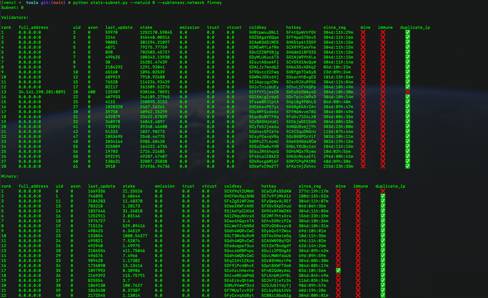
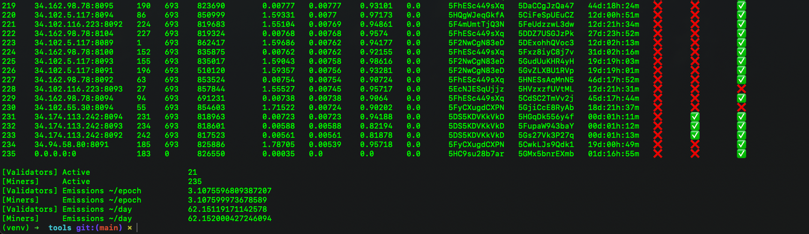

# tools

```
python -m venv venv
source ./venv/bin/activate
pip install -r requirements.txt
```

## stats-subnet

Scripts to get a quick overview of the performing keys of a subnet.

```bash
# specifying subnet uid:
python stats-subnet.py --netuid 0
# with all available arguments
python stats-subnet.py --netuid 0 --weights --long_key --round 6 --sort trust 
# with bittensor args
python stats-subnet.py --netuid 0 --subtensor.network local --wallet.path "~/my/bittensor/wallets/path"
```

### root subnet example



### subnet 2 total example


## Contribution

Feel free to add any useful tool to the community !

How to contrib ?

- use pre-commit and black (mentioned in the requirements), 
- add the details in the readme
- submit a pr
